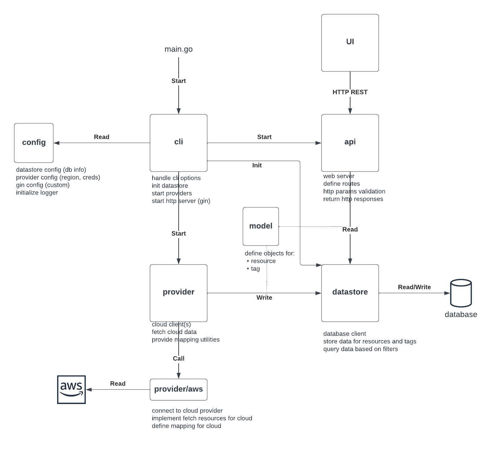

# development notes

This application provides a single binary that contains the backend and the frontend.

## Project structure

The project structure is inspired by https://github.com/sosedoff/pgweb

    .
    ├── pkg                                  # Backend: Golang
    └── cmd                                  # CLI semi-generated framework (also Golang)
    └── static                               # Frontend: Static assets
    └── main.go                              # Executable main function
    └── Makefile                             # Defines the tasks to be executed - for local or CI run

## Start the server

```shell
# using local code
make run
```

```shell
# using local binary
make build
./cloudgrep
```

### AWS Resource supported

| Type            |  Status |
|-----------------| ----------- |
| EC2 Instance    |  :white_check_mark: |
| Load Balancer   |  :white_check_mark: |
| S3 Bucket       |  :white_check_mark: |
| EBS             |  :white_check_mark: |
| RDS             |  :white_check_mark: |
| Lambda Function |  :white_check_mark: |

## Design



- **cli**: this the application entry point, starts all the various components
- **provider**: the provider is responsible for fetching the resource data from the cloud and write it to the datastore. The implementation specific to a cloud provider is done in their own package.
- **datastore**: the datastore provides an interface to read/write/update the collected data. The storage is done in a database.
- **api**: the api is the Gin HTTP server. It defines the routes and implements the api endpoints.
- **config**: all the application configuration is defined in this package. The user can provide a `config.yaml` file or use the default values.
- **model**: these are the base objects to contain *resources* and *tags*.
- **UI**: this is the frontend layer.

All of these boxes are implemented as distinct Go packages, except for UI which is a JS app.

## Configure a new aws resource

1. Implement a new AWS provider method (in pkg/provider/aws) to fetch your resources. It must have the type
   signature of a FetchFunction like so: `type FetchFunc func(context.Context, chan<- model.Resource) error`.
   Please refer to the following example:
   ```go
   func (p *Provider) FetchEC2Instances(ctx context.Context, output chan<- model.Resource) error {
       resourceType := "ec2.Instance"
       ec2Client := ec2.NewFromConfig(p.config)
       input := &ec2.DescribeInstancesInput{}
       paginator := ec2.NewDescribeInstancesPaginator(ec2Client, input)
   
       resourceConverter := p.converterFor(resourceType)
       for paginator.HasMorePages() {
           page, err := paginator.NextPage(ctx)
           if err != nil {
               return fmt.Errorf("failed to fetch EC2 Instances: %w", err)
           }
   
           for _, r := range page.Reservations {
               if err := resourceconverter.SendAllConverted(ctx, output, resourceConverter, r.Instances); err != nil {
                   return err
               }
           }
       }
   
       return nil
   }
   ```
2. [Optional] Implement the method to return the tags. Unless there is already a `Tags` field, this method would need 
    to be implemented. It should have the type signature `type tagFunc[T any] func(context.Context, T) (model.Tags, error)`
    where T is the aws resource being ingested. Here is an example for Load Balancer:
   ```go
   func (p *Provider) FetchLoadBalancerTag(ctx context.Context, lb types.LoadBalancer) (model.Tags, error) {
       elbClient := elbv2.NewFromConfig(p.config)
       tagsResponse, err := elbClient.DescribeTags(
           ctx,
           &elbv2.DescribeTagsInput{ResourceArns: []string{*lb.LoadBalancerArn}},
       )
       if err != nil {
           return nil, fmt.Errorf("failed to fetch tags for load balancer %v: %w", *lb.LoadBalancerArn, err)
       }
       var tags model.Tags
       for _, tagDescription := range tagsResponse.TagDescriptions {
           for _, tag := range tagDescription.Tags {
               tags = append(tags, model.Tag{Key: *tag.Key, Value: *tag.Value})
           }
       }
       return tags, nil
   }
    ```
3. Add a new mapper struct to the list returned by getTypeMapping in `pkg/provider/aws/types.go`
   This struct has 4 fields:
   * `IdField`: Name of id field in ingested aws resource struct
   * `TagField`: A struct of the TagField type used to dictate where. Leave this empty if passing the tagfields separately like with the load balancer
   * `FetchFunc`: The fetch function created in step 1
   * `IsGlobal`: Set to true if this is a global resource (like a Hosted Zone). Otherwise leave empty.


These methods will be automatically called at startup.
The mapper definition will be used to convert the returned type to some `model.Resource` objects.
